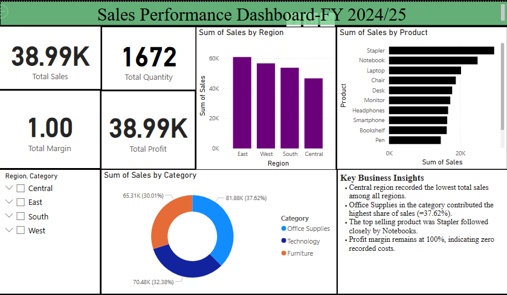

# 📊 Sales Performance Dashboard – FY 2024/25

This project is an interactive Sales Performance Dashboard built in Power BI to analyze key business metrics across different regions, product categories, and top selling products.

---

## 🛠️ Tools Used
- Excel – for data cleaning and preparation
- Power BI – for data modeling, visualization, dashboard creation and storytelling

---

## 📌 Dashboard Features
- **KPIs**: Total Sales, Total Quantity, Total Margin, Total Profit
- **Visuals**:
  - Sales by Region (Column Chart)
  - Top-Selling Products (Bar Chart)
  - Sales by Category (Donut Chart)
- **Filters**: Region, Category slicer
- **Insights Panel**: Highlighting key findings

---

## 💡 Key Business Insights
- 📉 Central region recorded the **lowest total sales**.
- 📦 **Office Supplies** contributed the **highest share of sales** (~37.6%).
- 🏆 **Stapler** was the top-selling product, followed by **Notebook**.
- 💯 Profit margin remains at **100%**, indicating zero recorded costs (in sample data).

---

## 📷 Dashboard Preview

---

## 💼 Skills Demonstrated
- Data cleaning and formatting in Excel
- Power BI dashboard design
- KPI tracking and DAX basics
- Business insight generation

---

## 📬 Contact

For feedback or collaboration:  
📧 oketageofrey@gmail.com  
🔗 www.linkedin.com/in/geofrey-oketa-494130240
